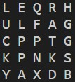
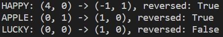
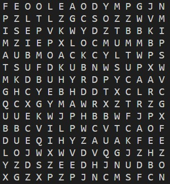
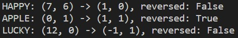

# Auto Wordsearch🔍
Generate a randomized wordsearch puzzle or solve one when you provide a list of words!

Currently requires `Python3`.

## How to use
Currently, `./auto_wordsearch/puzzle/` holds completed code for `generate.py` and `solve.py`.

### `generate.py`
This file contains `WordsearchGenerator`, which allows you to randomly generate a square wordsearch puzzle grid if you provide it with a list of words. For example:

```
wordlist = ["HAPPY", "APPLE", "LUCKY"]
puzzle = WordsearchGenerator(wordlist, size=5)
puzzle.generate_puzzle()
```

Will print out a puzzle like below:



Words would be inserted into random locations and orientations, including *reverse*. Like a true wordsearch, words can also *overlap* one-another.

The puzzle grid is represented as a list of lists, where each internal list is a row. This grid is stored as `self.wordsearch_arr`.

To find the solution to the generated puzzle, run:
```
puzzle.print_solutions()
```
Which prints out:



This has the format of:
```
WORD: (ROW, COL) -> (i, j), reversed: bool
```
Where `ROW` and `COL` are zero-indexed, and `(i, j)` represent the orientation of the word, with positive `i` pointing 'south' and `j` pointing 'east'. For example, `(-1, 1)` indicates 'north east' direction.

Since the process is random, there is a very small chance that generation fails to find a permutation that fits all words. In that case, just run again. The probablity of success increases with a greater grid size relative to the length of the words to be inserted.

Here's another, larger, example puzzle and solution:





### `solve.py`
This contains `WordsearchSolver`, which when given a puzzle grid and list of words to find, will use a brute force approach to find the location and orientation of each word. The solver will always return the solution to the first instance of the word it finds.

Just like `WordsearchGenerator`, the solver takes in the puzzle as a list of lists, where each internal list is a row.
```
# Generate a random example puzzle
wordlist = ["HAPPY", "APPLE", "LUCKY"]
puzzle = WordsearchGenerator(wordlist, size=15)
puzzle.generate_puzzle()

# Solve the puzzle
solver = WordsearchSolver(puzzle.wordsearch_arr, wordlist)
solver.solve()
solver.print_solutions()
```
The format of the printed solution is almost the same as that of `WordsearchGenerator`, with the lack of the reversed boolean. The solver does not care (or know) if the word was positioned in reverse order since orientation: `(-1, 0)` reversed is the same as `(1, 0)`.

Unlike `WordsearchGenerator`, if the word exists inside the grid then the solver will always find it.

## Plans
- Use computer vision / OCR so that it is possible to solve a puzzle from an image.
- Improve solving algorithm to be better than brute force.
- Develop a web service for generating and solving wordsearch puzzles.
